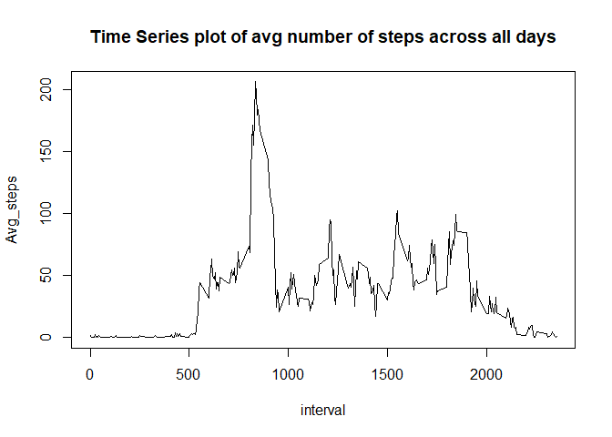

### REPRODUCIBLE RESEARCH- PERSONAL ACTIVITY WEEK 2 PROJECT


### Introduction
This assignment makes use of data from a personal activity monitoring
device. This device collects data at 5 minute intervals through out the
day. The data consists of two months of data from an anonymous
individual collected during the months of October and November, 2012
and include the number of steps taken in 5 minute intervals each day.

### Data

The data for this assignment can be downloaded from the course web
site:

* Dataset: [Activity monitoring data](https://d396qusza40orc.cloudfront.net/repdata%2Fdata%2Factivity.zip) [52K]

The variables included in this dataset are:

* **steps**: Number of steps taking in a 5-minute interval (missing
    values are coded as `NA`)

* **date**: The date on which the measurement was taken in YYYY-MM-DD
    format

* **interval**: Identifier for the 5-minute interval in which
    measurement was taken

The dataset is stored in a comma-separated-value (CSV) file and there
are a total of 17,568 observations in this
dataset.

### Loading and preprocessing the data


```r
activity_data <- read.csv("activity.csv", header=T)
str(activity_data)
```

```
## 'data.frame':	17568 obs. of  3 variables:
##  $ steps   : int  NA NA NA NA NA NA NA NA NA NA ...
##  $ date    : Factor w/ 61 levels "2012-10-01","2012-10-02",..: 1 1 1 1 1 1 1 1 1 1 ...
##  $ interval: int  0 5 10 15 20 25 30 35 40 45 ...
```

```r
activity_data$date<- as.Date(activity_data$date)
str(activity_data)
```

```
## 'data.frame':	17568 obs. of  3 variables:
##  $ steps   : int  NA NA NA NA NA NA NA NA NA NA ...
##  $ date    : Date, format: "2012-10-01" "2012-10-01" ...
##  $ interval: int  0 5 10 15 20 25 30 35 40 45 ...
```

### What is mean total number of steps taken per day?

```r
library(dplyr)
```

```
## Warning: package 'dplyr' was built under R version 3.4.2
```

```
## 
## Attaching package: 'dplyr'
```

```
## The following objects are masked from 'package:stats':
## 
##     filter, lag
```

```
## The following objects are masked from 'package:base':
## 
##     intersect, setdiff, setequal, union
```

```r
activity_df <- tbl_df(activity_data)
activity_df_sub1 <- activity_df %>% group_by(date)%>%summarise(total_steps= sum(steps, na.rm= TRUE))
hist(activity_df_sub1$total_steps, col="lightblue", main= "Histogram of total steps per day", xlab="Total number of daily steps")
```

<!-- -->

```r
mean1<-mean(activity_df_sub1$total_steps)
median1<- median(activity_df_sub1$total_steps)
```
The mean total number of steps taken daily is 9,354 and median total number of steps taken daily is 10,395

### What is the average daily activity pattern?

```r
activity_df_sub2 <- activity_df %>% group_by(interval)%>%summarise(Avg_steps= mean(steps, na.rm= TRUE))
with(activity_df_sub2, plot(interval,Avg_steps, type="l", main="Time Series plot of avg number of steps across all days"))
```

<!-- -->

 The 5 min interval that contains the maximum number of steps is 
835

### Imputing missing values
Note that there are a number of days/intervals where there are missing
values (coded as `NA`). The presence of missing days may introduce
bias into some calculations or summaries of the data.

1. Calculate and report the total number of missing values in the dataset (i.e. the total number of rows with `NA`s)

```r
sum(is.na(activity_df))
```

```
## [1] 2304
```
The total number of missing values in the dataset is 2304

2. Devise a strategy for filling in all of the missing values in the dataset.Here we are using mean of the 5 minute intervals as follows

```r
act <- activity_df
nas<- is.na(act$steps)
act$interval<- as.factor(act$interval)
avgdailyinterval <- tapply(act$steps, act$interval, mean, na.rm= TRUE, simplify=TRUE)
head(avgdailyinterval)
```

```
##         0         5        10        15        20        25 
## 1.7169811 0.3396226 0.1320755 0.1509434 0.0754717 2.0943396
```

3. Create a new dataset that is equal to the original dataset but with the missing data filled in.

```r
act$steps[nas]<- avgdailyinterval[as.character(act$interval[nas])]
head(act)
```

```
## # A tibble: 6 x 3
##       steps       date interval
##       <dbl>     <date>   <fctr>
## 1 1.7169811 2012-10-01        0
## 2 0.3396226 2012-10-01        5
## 3 0.1320755 2012-10-01       10
## 4 0.1509434 2012-10-01       15
## 5 0.0754717 2012-10-01       20
## 6 2.0943396 2012-10-01       25
```

```r
sum(is.na(act))
```

```
## [1] 0
```

4. Make a histogram of the total number of steps taken each day and Calculate and report the **mean** and **median** total number of steps taken per day. Do these values differ from the estimates from the first part of the assignment? What is the impact of imputing missing data on the estimates of the total daily number of steps?

```r
actsub<- act %>% group_by(date)%>%summarise(total_steps= sum(steps))
hist(actsub$total_steps, col="lightblue", main="Histogram of total steps per day after missing values imputation", xlab = "Total number of daily steps")
```

<!-- -->


Calculating mean and median number of steps

```r
mean2<-mean(actsub$total_steps)
median2<- median(actsub$total_steps)
```

The mean total number of steps taken daily is 10,766 and median total number of steps taken daily is 10,766.19

These differ from the values without the missing values imputation as follows
Mean by about 1412 and Median by about 371

Difference in plots can be seen as follows-

```r
par(mfrow=c(1,2))
hist(activity_df_sub1$total_steps, col="lightblue",ylim = c(0,35), main= "Histogram before impute", xlab="Total number of daily steps")
hist(actsub$total_steps, col="lightblue", main="Histogram after impute", xlab = "Total number of daily steps")
```

<!-- -->


### Are there differences in activity patterns between weekdays and weekends?

```r
library(ggplot2)
```

```
## Warning: package 'ggplot2' was built under R version 3.4.3
```

```r
actwkdywknd <- act
actwkdywknd <- mutate(actwkdywknd, weektype = ifelse(weekdays(actwkdywknd$date)=="Saturday"| weekdays(actwkdywknd$date)=="Sunday", "Weekend", "Weekday"))
```

```
## Warning: package 'bindrcpp' was built under R version 3.4.2
```

```r
actwkdywknd$weektype<- as.factor(actwkdywknd$weektype)
head(actwkdywknd)
```

```
## # A tibble: 6 x 4
##       steps       date interval weektype
##       <dbl>     <date>   <fctr>   <fctr>
## 1 1.7169811 2012-10-01        0  Weekday
## 2 0.3396226 2012-10-01        5  Weekday
## 3 0.1320755 2012-10-01       10  Weekday
## 4 0.1509434 2012-10-01       15  Weekday
## 5 0.0754717 2012-10-01       20  Weekday
## 6 2.0943396 2012-10-01       25  Weekday
```

```r
actwkdywkndsub <- actwkdywknd %>% group_by(interval, weektype)%>% summarise(steps= mean(steps))
g <- ggplot(actwkdywkndsub, aes(x=interval,y=steps, group=1))+geom_line() + facet_wrap(~weektype, ncol=1,nrow=2)
print(g)
```

<!-- -->


We can see the difference between the activities on weekdays and weekends as above. 
